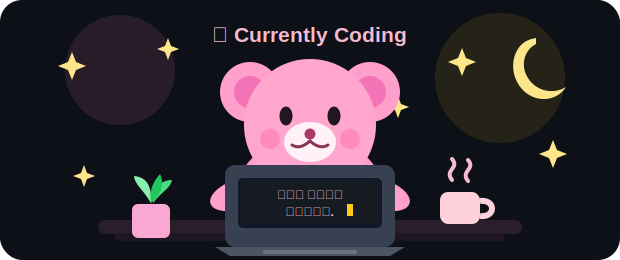

 

---
## 🧸 Currently Coding

  

---

## 🛠 Tech Stack & Stats

 

<table align="center">
  <tr>
    <td align="center" width="60%">
      
      
      
       
      
      
      
       
      
      
      
    </td>
    <td align="center" width="40%">
      
    </td>
  </tr>
</table>

---

## 🌱 About Me

- 사용자 경험을 고려한 **UI/UX**를 고민합니다.
- 기능 구현에서 끝나지 않고 **다시 찾고 싶은 서비스**를 만드는 것을 목표로 합니다.
- 협업과 꾸준한 성장을 통해 더 나은 개발자가 되고자 합니다.

---

## 🚀 Projects

| Project | Description | Tech |
|---------|-------------|------|
| **PassMate AI** | AI 기반 개인 맞춤형 시험 학습 플랫폼 | Next.js · TypeScript · FastAPI |
| **HipMap** | AR 기반 위치 기록 및 공유 서비스 | Android · Unity · Firebase |
| **Unity 2D Game** | Unity 기반 2D 게임 | Unity · C# |

---

## 📫 Contact

